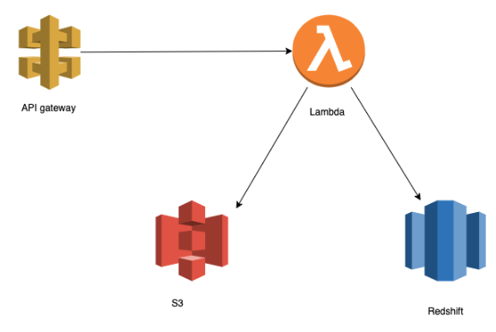
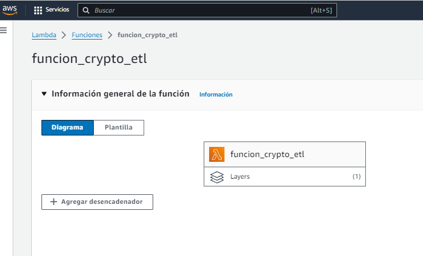
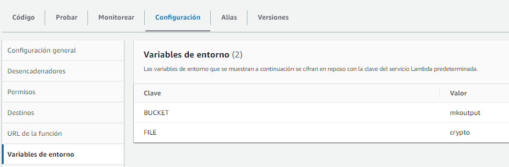
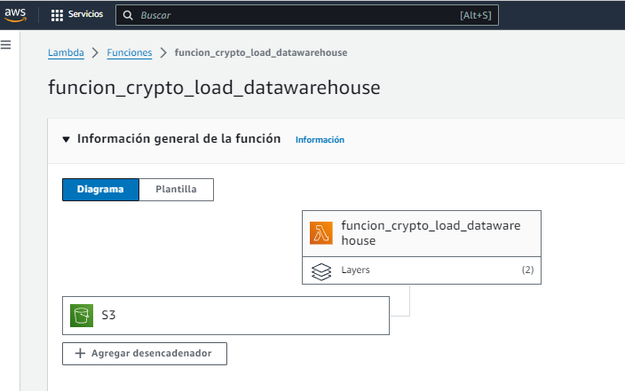
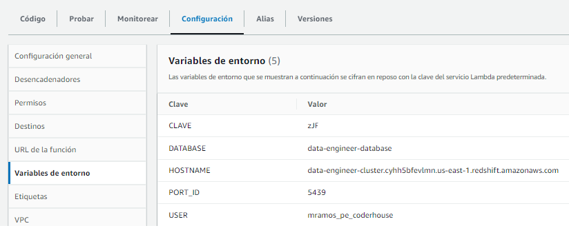

# Amazon AWS Cloud Lambda, S3 y RedShift. Data Engineer

Proyecto propio con la infraestructura de nube de Amazon, Lambda para automatizar el ETL, S3 como storage y RedShift como BD. Utilizamos una API de cryptomonedas.

## CONTENIDO - CODIGO FUENTE

- funcion_crypto_etl/[lambda_function.py](funcion_crypto_etl/lambda_function.py) : Realiza el proceso ETL, usa S3 como storage
- funcion_crypto_load_datawarehouse/[lambda_function.py](funcion_crypto_load_datawarehouse/lambda_function.py) : Realiza un load del S3, luego carga a la BD AWS RedShift usando un carga incremental.

## DESCRIPCION

Arquitectura del Sistema

Funcion lambda ETL

Funcion lambda ETL variables

Funcion lambda Load Datawarehouse

Funcion lambda Load Datawarehouse variables

